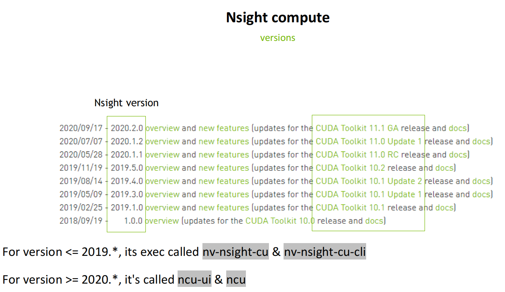
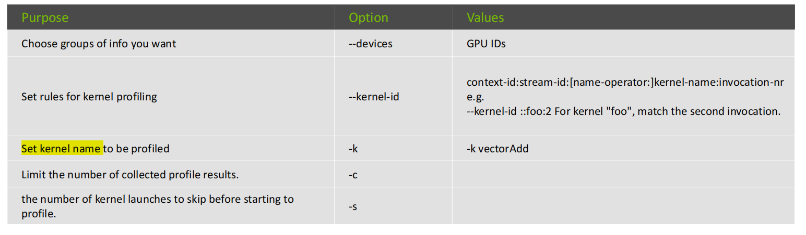

# Nsight Compute
- https://docs.nvidia.com/nsight-compute/NsightComputeCli/index.html

## Version


## Workflow
- ncu **replays every kernel launch multiple times** for analysis
```text
User launches profiling
↓
Nsight Compute (Host)
↓
Injects profiling code into Application
↓
Application runs with CUDA Runtime
↓
Nsight Compute Injection collects metrics via CUDA Driver
↓
Data sent back to Host for analysis
```

## Options


## Compute/Memory Workload Analysis
skimmed.

## Scheduler Stats
Each scheduler maintains a pool of warps that it can issue instructions for. Each Warp Slot can be in different states:

- stalled: waiting for last instruction to finish

- eligible: ready for next instruction

- selected(issued): choose one from the eligible to issue one or more instructions
