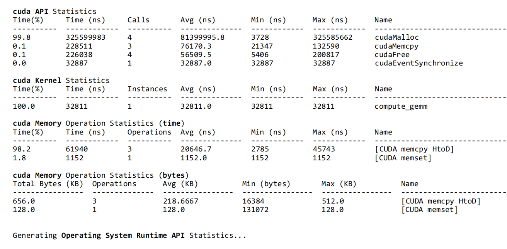
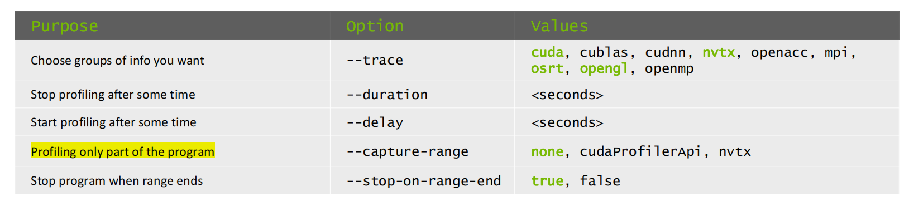
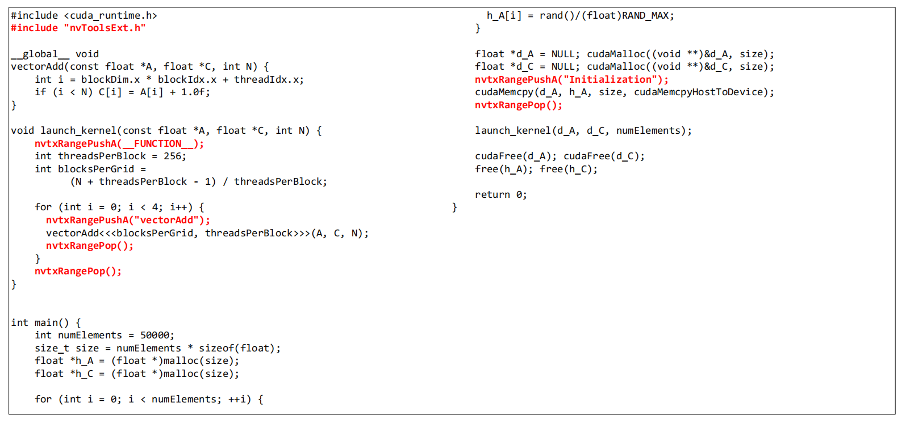

# Nsight system
- https://docs.nvidia.com/nsight-systems/index.html#nsight_systems/2020.2.1-x86
```bash
nsys profile -o report_path ./my_program --stats=true
# Saving report to file "~/nvidia_nsight_systems/report.qdrep"
```



## NVTX: NVIDIA Tools Extension API
- https://nvidia.github.io/NVTX/doxygen/index.html

- annotate the timeline with application's logic


- NVTX within Pytorch
  
```python
torch.cuda.nvtx.range_push("Iteration {}").format(i)
torch.cuda.nvtx.range_push("Forward")
output = model(input)
torch.cuda.nvtx.range_pop() # Pop range Forward

loss = criterion(output, target)

torch.cuda.nvtx.range_push("Backward")
loss.backward()
optimizer.step()
torch.cuda.nvtx.range_pop() # Pop range Backward

torch.cuda.nvtx.range_pop() # Pop range Iteration
```
