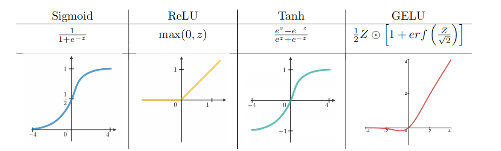

# Common Utilities Used in NumPy Operations

## `np.where` & `np.maximum`
- RELU activation function forward & backward


- https://numpy.org/doc/2.1/reference/generated/numpy.amax.html#numpy-amax
> Return the maximum of an array or maximum along an axis.
- https://numpy.org/doc/2.1/reference/generated/numpy.maximum.html
```Python
numpy.maximum(x1, x2, /, out=None, *, where=True, casting='same_kind', order='K', dtype=None, subok=True[, signature]) = <ufunc 'maximum'>
Element-wise maximum of array elements.
```
> Compare two arrays and return a new array containing the element-wise maxima. If one of the elements being compared is a NaN, then that element is returned. If both elements are NaNs then the first is returned. The latter distinction is important for complex NaNs, which are defined as at least one of the real or imaginary parts being a NaN. The net effect is that NaNs are propagated.
- https://numpy.org/doc/2.1/reference/generated/numpy.where.html#numpy-where
`numpy.where(condition, [x, y, ])
> Return elements chosen from x or y depending on condition.

```Python
class ReLU():
    def forward(self, x):
        self.A = np.maximum(x, 0)
        return self.A

    def backward(self, x, dLdA):
        return dLdA * np.where(self.A > 0, 1, 0)
```